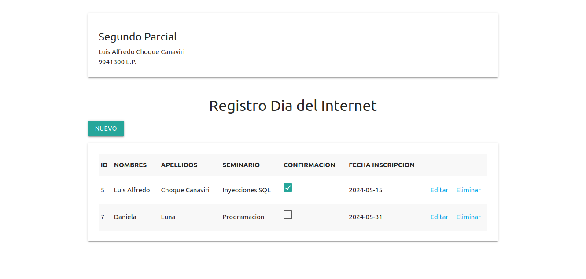
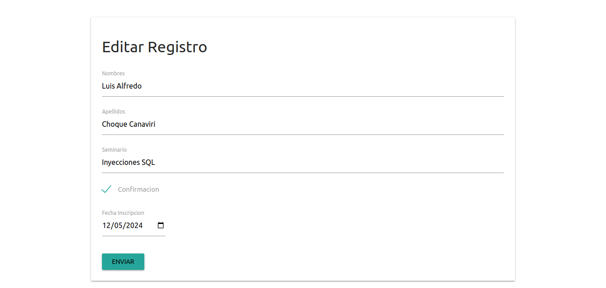

# Segundo Parcial

## Descripción
El sistema realiza el registro de incripciones de estudiantes a seminarios que se realizaran en el dia del internet

## Herramientas Utilizadas
- **Lenguaje:** java
- **IDE:** Apache-Netbeans v20
- **Servidor:** Tomcat v9
- **Base de Datos:** MariaDB

## Capturas de Pantalla
### Pantalla Principal

### Formulario de Registros
